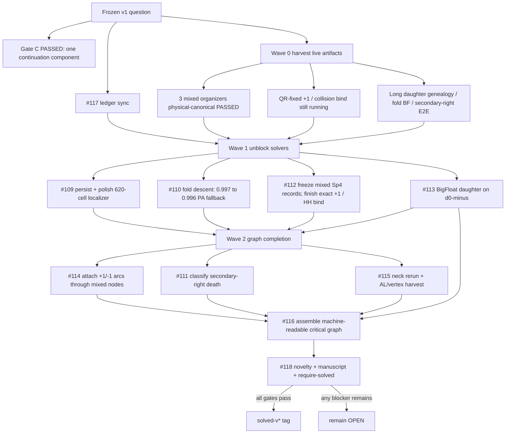

# ATLAS v1 god-mode execution DAG

Scientific status remains `OPEN` until Gates A/B/D pass and `#118`’s solved gate
authorizes a `solved-v*` tag. This file is the control-plane graph for finishing
the frozen problem, not a new research direction.

## Wave rules

1. Harvest before launching. Do not duplicate secondary-right / fold-BigFloat / long-genealogy jobs that are already running.
2. Never loosen a scientific gate to get a green check.
3. `Newton failed` is not an endpoint class.
4. Do not mark `SOLVED` from a denser plot, an ML proposal, or a float64-only collision.

## What this branch attacks immediately

- `#117` / Gate C bookkeeping: ledger and discovery manifest now match the passed connectivity certificate.
- `#112` harvest: the three mixed-canonical Actions artifacts are frozen under `research/evidence/` with `passed: true`.
- `#109`: persist every 620-cell attempt; polish the event with a 1-D `m2` Newton; keep the `2e-8` event gate.
- `#110`: if fixed-`m1` descent dies after one point, start hybrid continuation from the published `0.997 → 0.996` pair and still write a JSON.
- `#113`: independently correct the physical-soft **minus** representative, not the near-switch plus seeds that already stalled at `1e-9`.
