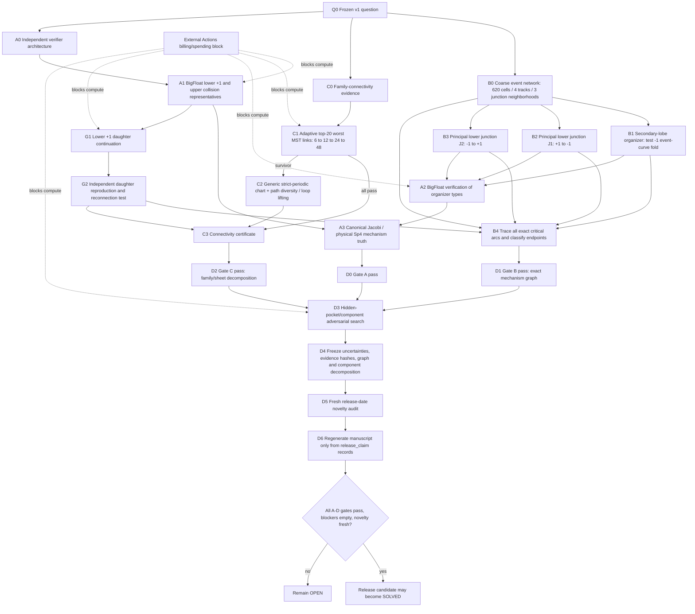

# ATLAS v1 research graph

This document is the execution graph for the frozen v1 question. It converts the research ledger, closure gates, current artifacts, negative results, and release contract into one dependency-driven plan.

**Scientific status:** `OPEN` — the frozen v1 problem is not solved.

**Scope:** continuation-connected family decomposition of the Li--Li--Liao unequal-mass non-hierarchical catalog, plus the connected **planar linear Floquet** stability-critical manifold, its physical mechanisms, organizers, and branch connections. This does not claim spatial stability, nonlinear/KAM stability, or a solution of the general three-body problem.

## 1. Research dependency graph

The graph deliberately places family connectivity, critical-set geometry, and independent truth in parallel. None can substitute for another. A visually plausible mass-plane boundary cannot prove family identity; a continuation bridge cannot classify a Floquet mechanism; a BigFloat point cannot establish the global critical graph.

## 2. Node ledger: evidence, decisive test, promotion rule

| Node | Current state | What is already supported | Next decisive action | Promotion criterion |
|---|---|---|---|---|
| `A1` | **pending / compute-ready** | The earlier monolithic Julia run reached roughly `1e-26` periodic closure on both representative event searches before timeout. The verifier is now split into lower `+1` and upper collision matrix jobs. | Run `.github/workflows/julia-critical-curve-verifier.yml` at frozen precision/tolerance settings, then repeat with escalated precision/tighter tolerance. | Both representatives independently correct, event location converges, parameter bracket/uncertainty is stable, and required output artifacts are retained. |
| `A3` | **partial structural** | The physical `E^omega/E` four-dimensional quotient passes the frozen float64 structural audit. Independent canonical BigFloat work already shows excellent symplectic/reciprocal structure on coarse stable/unstable anchors. | Evaluate canonical Jacobi monodromy and physical quotient at the independently corrected critical points. | Closure, event residual, symplectic defect, reciprocal pairing, neutral invariance and eigenspace conditioning all satisfy frozen gates; Krein/Hamiltonian-Hopf language is used only if the exact critical spectrum supports it. |
| `B0` | **screening-supported** | All 620 published S/U cells have one endpoint-sign-changing smooth reduced-Floquet event: 198 `+1`, 168 `-1`, 254 trace collision. Four macroscopic tracks and three coarse cross-mechanism junction neighborhoods are identified. | Use these cells only as seeds for exact event-curve continuation. | The coarse network is superseded by a connected critical graph with exact arcs and organizers. |
| `B1` | **candidate** | A secondary-lobe `-1` fold candidate exists near `(m1,m2)=(0.9957049987,0.9742436529)`. A direct mixed `(+1,-1)` vertex search accepted no candidate. | Trace the `P(-2)=0` critical arc with six-variable pseudo-arclength through the birth region; localize the projection fold from the continuation tangent/curvature rather than nested mass-only finite differences; reproduce it in BigFloat. | Same event arc is followed through a nondegenerate fold, with converged critical equations and nonzero transverse derivative/curvature; otherwise fall back to multiple-root/mixed-vertex hypotheses. |
| `B2` | **unresolved** | Principal lower track changes from `+1` to `-1` around the first coarse junction. Direct global mixed-vertex search did not accept a vertex. | Seed `+1` and `-1` event-specific pseudo-arclength traces on both sides of the junction; test whether they meet at `(alpha,beta)=(4,4)`, miss as separate arcs, or reveal multiple roots within a coarse cell. | Every local edge and organizer is explained with no “Newton failed” endpoint. |
| `B3` | **unresolved** | Principal lower track changes from `-1` to `+1` around the second coarse junction. | Same event-specific protocol as `B2`, independently seeded from both mechanisms. | Same as `B2`. |
| `B4` | **pending** | Universal event algebra and six-variable pseudo-arclength machinery already exist. | Trace all critical arcs to physical/domain/organizer endpoints, merge repeated traces, assign sheet ID, mechanism, uncertainty and evidence, and verify no unexplained local termination. | Final object is a graph, not a sampled cloud. Each edge and vertex has a physical interpretation and reproducible evidence. |
| `C0` | **strong screening / not global proof** | Corrected invariant projection is folded/non-injective; five macroscopic cuts pass; the adversarial far-mass/invariant-near pair passes in both Li and generic strict-periodic charts; the 28 lowest-rank candidates all correct above the fixed `1e-6` suspicion ratio. | Complete the globally worst-edge audit. | No surviving disconnection evidence after rank, reverse, chart-independence and path-diversity attacks. |
| `C1` | **pending / compute-ready** | Five balanced cuts and the first two globally largest MST jumps passed. The third hard edge `(0.839,0.721,1)<->(0.838,0.721,1)` failed the reverse six-substep Li walk at residual about `7.609e-05` versus the frozen `2e-7` gate. | Run `.github/workflows/adversarial-connectivity-edges.yml` for ranks 1-20 with 6 -> 12 -> 24 -> 48 substeps and no threshold relaxation. | Every edge passes bidirectionally, or each survivor is escalated to `C2`. |
| `C2` | **conditional fallback** | Generic translation-reduced strict-periodic infrastructure already passed the deliberately pathological bridge. | Re-run every surviving hard MST link in the generic chart; if necessary use path diversity and loop lifting. | A generic/path-diverse bridge closes, or there is reproducible branch-separation evidence strong enough to revise the family decomposition. |
| `G1` | **candidate branch genealogy** | Ten distinct same-period generic daughter candidates were found from the lower `+1` physical transverse directions. | Select the cleanest signed candidate pair and pseudo-arclength continue away from the parent in the generic formulation. | A persistent daughter branch is traced beyond the local amplitude-constrained solve with controlled closure and no collapse back to the parent gauge orbit. |
| `G2` | **pending** | No independent daughter-family reproduction yet. | Independently reproduce selected daughter points/segment and test whether the branch reconnects to the catalog sheet, another critical edge, or remains separate. | Branch genealogy is explicit enough to enter the critical/family graph; otherwise the daughter interpretation remains screening-only. |
| `D3-D6` | **pending** | Machine OPEN/SOLVED claim firewall, discovery manifest, dossier builder and same-day novelty audit exist. | Hidden-component search -> evidence/uncertainty freeze -> fresh novelty search -> manuscript regeneration -> hard solved gate. | Gates A-D pass, blockers are empty, at least one claim is `release_claim`, novelty is fresh, and the paper is generated from that exact manifest. |

## 3. Decision trees for the unresolved scientific points

### 3.1 Secondary stable-lobe birth

1. Start from the accepted `-1` fold screening candidate.
2. Correct two neighboring `P(-2)=0` points in the six-variable critical chart.
3. Trace the `-1` arc through the neighborhood with event-specific pseudo-arclength.
4. Monitor the continuation tangent in mass projection and localize the projection fold where the chosen mass component changes sign.
5. Verify nondegenerate curvature/transversality and then reproduce the fold independently in BigFloat.
6. If the arc does **not** produce a stable fold, reopen the alternatives: multiple critical zeros in one coarse S/U cell, separated sheet association, or a mixed spectral vertex.

**Do not** use the older nested `dP(-2)/dm2` finite-difference solve as publication truth. It remains a seed generator only.

### 3.2 Two principal `+1/-1` mechanism changes

For each junction independently:

1. localize nearby `+1` and `-1` critical seeds;
2. trace both smooth event equations into the junction neighborhood;
3. track `(alpha,beta)` continuously;
4. test the exact mixed-vertex condition `(alpha,beta)=(4,4)` only where the two event arcs geometrically approach;
5. if no vertex exists, search explicitly for more than one critical root inside the coarse cell and for sheet/association swaps;
6. classify the organizer only after the exact local graph is known.

The negative direct mixed-vertex search is useful evidence against an easy codimension-two solve, but it is not evidence that no mixed vertex exists globally.

### 3.3 Hard family-connectivity edges

For each of the twenty globally worst MST links:

1. Li-chart forward/reverse at 6 substeps;
2. if either direction fails, retry 12, 24, then 48 substeps with the **same** residual and terminal-match gates;
3. if 48 still fails, switch to the generic translation-reduced strict-periodic chart;
4. if the generic chart fails, try path-diverse intermediate mass routes and loop lifting around the suspected singular/branch region;
5. only a reproducible failure across independent charts/paths may support a component split.

A Li-chart Newton failure is never a family endpoint.

### 3.4 Lower `+1` daughter branch

1. Rank the ten local candidates by closure, conditioning, parent distance and symmetry contamination.
2. Continue at least one signed pair using a generic gauge-fixed pseudo-arclength formulation.
3. Track strict periodicity, topology signature, physical Floquet spectrum and distance from the parent sheet.
4. Test reconnection to the catalog sheet and/or another critical edge.
5. Reproduce representative daughter points independently before assigning branch genealogy.

A local amplitude-constrained solution is not yet a daughter family.

## 4. Engineering plan while Actions is blocked

The current runner block prevents compute but does not prevent finishing the research machinery. Work should proceed in this order:

1. **Event-junction tracer** — add a script/workflow that consumes the three coarse junction neighborhoods and traces `plus_one` / `minus_one` arcs using the existing six-variable `critical_manifold.py` and `critical_geometry.py` machinery. Output one machine-readable local graph per junction.
2. **Secondary-fold exact tracer** — replace the nested finite-difference fold search as the decisive path with tangent/curvature localization on the event-specific critical arc. Keep the existing fold script only as a seed generator/regression test.
3. **Daughter continuation** — extend the lower `+1` probe into a real branch continuation workflow with reconnect/termination diagnostics.
4. **Critical-graph assembler** — merge global coarse track identity with exact traced arcs, organizer nodes, branch genealogy, sheet IDs, uncertainties and evidence references; reject unexplained endpoints.
5. **Hidden-component adversary** — seed critical searches away from the published 620 S/U cells and from both sides of every assembled graph edge to look for missed pockets/components inside the declared mass domain.
6. **Evidence promotion hooks** — make exact graph/daughter/fold outputs consumable by `DISCOVERY_RELEASE.json` and the solved-gate validator.

The split BigFloat representative verifier and adaptive top-20 connectivity workflow are already code-complete enough for the next compute wave; do not redesign them unless the resumed runs expose a concrete failure.

## 5. Compute order when GitHub Actions is restored

Run in parallel where dependencies allow:

**Wave 1 — truth + connectivity**

- split Julia lower `+1` representative;
- split Julia upper trace-collision representative;
- adaptive top-20 MST edge matrix.

**Wave 2 — organizers + genealogy**

- event-specific secondary `-1` fold trace;
- event-specific principal junction `+1/-1` traces for both neighborhoods;
- generic lower `+1` daughter continuation.

**Wave 3 — independent classification**

- BigFloat/canonical reproduction of every organizer type actually used;
- generic/path-diverse repeats for surviving connectivity edges;
- independent daughter reproduction/reconnection test.

**Wave 4 — global falsification and release**

- assemble exact critical graph;
- hidden critical-component/stability-pocket search;
- freeze uncertainties and provenance;
- refresh literature/citation chains;
- regenerate the manuscript and execute the hard solved-release gate.

## 6. Gate-by-gate definition of done

### Gate A — independent critical-point truth

Pass only when every headline mechanism used in the manuscript has:

- independent BigFloat periodic correction and event localization;
- precision/tolerance convergence;
- canonical Jacobi monodromy at the corrected critical point;
- closure, energy/angular momentum, symplectic, reciprocal-pairing, event and parameter uncertainty records;
- eigenspace/conditioning diagnostics where multiplier collisions make labels delicate.

### Gate B — exact critical graph

Pass only when:

- all declared critical arcs are traced directly as event equations;
- every mechanism change is resolved as a vertex, fold, multiple-zero cell, branch connection, or sheet association;
- no endpoint is justified only by solver failure;
- lower `+1` daughter genealogy is either established or explicitly rejected;
- physical mechanism labels have the evidence required by Gate A.

### Gate C — family/sheet connectivity

Pass only when:

- all serious rank-loss and worst-edge candidates survive reverse continuation and adaptive step attacks;
- every remaining suspicious bridge is repeated in a less-specialized formulation;
- path diversity/loop lifting is used where multiplicity or monodromy remains a live alternative;
- the final component decomposition follows continuation connectivity, not invariant projection branches.

### Gate D — release closure

Pass only when:

- hidden pocket/component searches are negative at the declared resolution/domain;
- the component decomposition and critical graph are frozen with uncertainties;
- evidence artifact IDs and GitHub artifact-metadata digests are frozen consistently;
- the release-date novelty audit is fresh;
- manuscript figures/tables are generated only from `release_claim` records;
- the machine discovery gate authorizes `SOLVED` on the exact release commit.

## 7. Artifact/provenance convention

For GitHub Actions evidence, `DISCOVERY_RELEASE.json` records the artifact digest exposed by GitHub's artifact metadata API. A locally downloaded archive may have a different byte-level ZIP hash because download packaging can differ. If both are retained, label them explicitly as `github_artifact_digest` and `downloaded_archive_sha256`; do not compare them as if they were the same checksum.

## 8. Stop rules

Until Gates A-D close, do **not** divert v1 into:

- spatial/vertical stability;
- nonlinear/KAM stability;
- Conley--Zehnder/Maslov/Floer bookkeeping;
- large unrelated family scans;
- AI discovery projects not tied to a falsification gate;
- complex-time/complex-mass continuation;
- formal moduli-space dimension claims not required by a live gate.

The shortest path remains:

> **independent truth -> worst-edge connectivity -> exact event organizers -> daughter genealogy -> exact critical graph -> adversarial closure -> novelty/manuscript freeze**.
